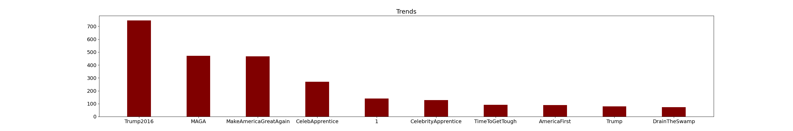
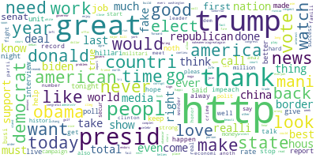

## Q1: Regex

- Checking if the input contains a doctors name

## Q2: NLTK

- Running word_tokenize and sent_tokenize methods of nltk library on a sample text

## Q3: Normalization

- Removing extra characters in the input word

## Q4: Tokenization

- Running these tokenizers on 4 different text samples:
  - TreebankWordTokenizer
  - RegexpTokenizer
  - WhitespaceTokenizer
  - WordPunctTokenizer

## Q5: Stemming

- Running these stemmers on a sample text:
  - LancasterStemmer
  - PorterStemmer

## Q6: Preprocessing

- Preprocessing a datasets containing around 60K tweets, by going through these steps:
- Top ten most common words in tweets (trends):

  

- Wordcloud

  

