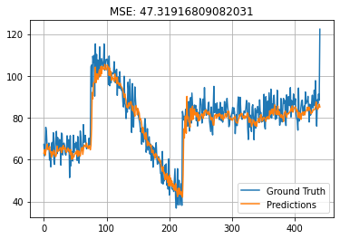

# Q1: RNN-based model

A model is implemented to predict the 21st day's data, using the previous 20 days' data.

## Dataset

Data is provided in train.csv and test.csv.

## Preprocessing

To create the appropriate input for the model, the data is divided into 20-unit windows.

## Model

A simple model with the following layers is created:

1. SimpleRNN with 16 units
2. Dense Layer with 8 units
3. Dense Layer with 1 unit

The model is compiled with 'mean_squared_error' as loss function and 'rmsprop' as optimizer.

## Training

The models is trained for 200 epochs.

## Evaluate

The following plot shows the result of our model. The final MSE is 47.319.

  

# Q2: Attention-based model

The notebook is provided in the assignment. Here's what I added:

- Implementation of GRU cell.
- Implmentation of AdditiveAttention.
- Using the GRU cell and the attention mechanism in a decoder.
